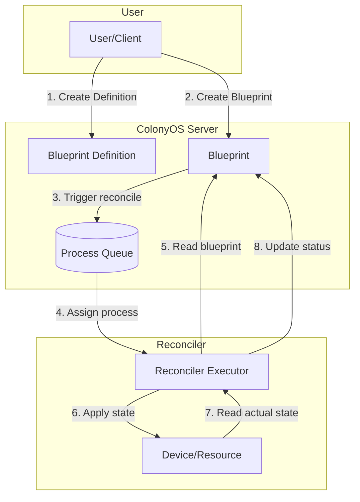
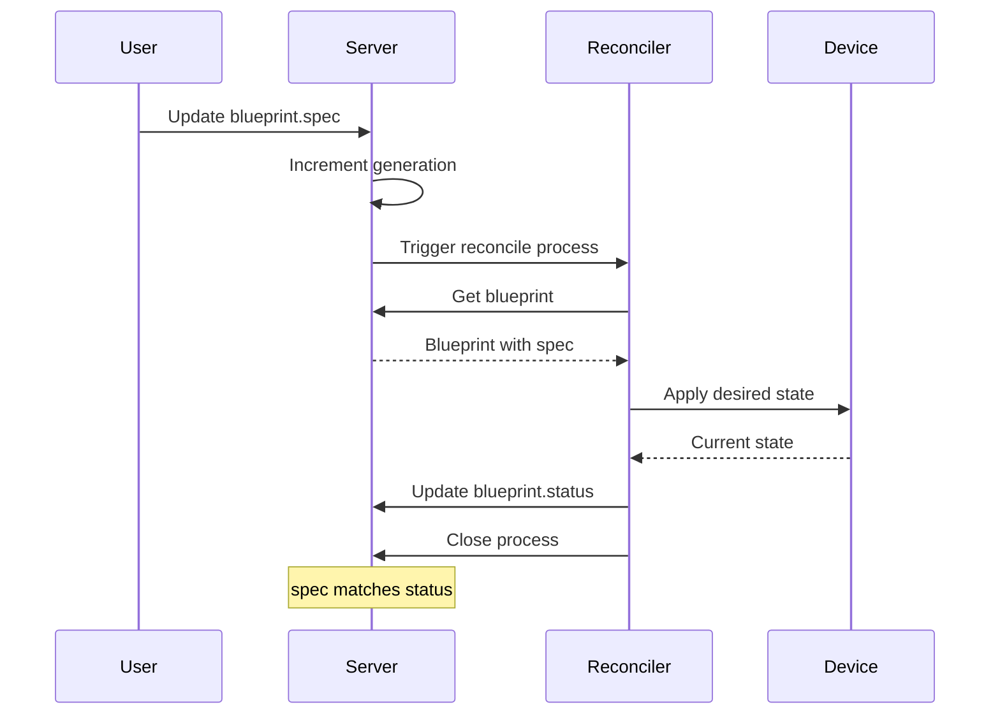

# Declarative State Management with Blueprints

This tutorial explains how to use ColonyOS blueprints to manage infrastructure and devices using a declarative, Kubernetes-inspired approach.

## What are Blueprints?

Blueprints provide declarative state management similar to Kubernetes Custom Resources:

- **Blueprint Definition**: Defines a type of resource (like a CRD)
- **Blueprint**: An instance with desired state (`spec`) and current state (`status`)
- **Reconciler**: An executor that watches blueprints and applies changes to match desired state

This pattern is ideal for:

- Home automation (lights, thermostats, locks)
- Infrastructure management (containers, VMs, services)
- IoT device orchestration
- Configuration management

## Architecture Overview



## Reconciliation Flow



## Prerequisites

1. Rust toolchain (1.70 or later)
2. ColonyOS server v1.9.6 or later (with blueprint support)
3. Basic familiarity with the [Getting Started](getting-started.md) guide

## Core Concepts

### Blueprint Definition

A Blueprint Definition describes a type of resource:

```rust
use colonyos::core::BlueprintDefinition;

let mut definition = BlueprintDefinition::default();
definition.kind = "Thermostat".to_string();
definition.metadata.name = "thermostat-def".to_string();
definition.metadata.colonyname = "dev".to_string();

// Names for CLI/API usage
definition.spec.names.kind = "Thermostat".to_string();
definition.spec.names.singular = "thermostat".to_string();
definition.spec.names.plural = "thermostats".to_string();

// Which executor type handles this resource
definition.spec.handler.executor_type = "home-reconciler".to_string();
```

### Blueprint Instance

A Blueprint represents a specific resource with desired and current state:

```rust
use colonyos::core::Blueprint;
use serde_json::json;

let mut blueprint = Blueprint::default();
blueprint.kind = "Thermostat".to_string();
blueprint.metadata.name = "living-room".to_string();
blueprint.metadata.colonyname = "dev".to_string();
blueprint.handler.executortype = "home-reconciler".to_string();

// Desired state (spec)
blueprint.spec.insert("targetTemp".to_string(), json!(22));
blueprint.spec.insert("mode".to_string(), json!("heat"));

// Current state (status) - updated by reconciler
// blueprint.status is initially empty
```

## Example: Home Automation Reconciler

This complete example shows a home automation system with thermostats.

### Step 1: Create the Blueprint Definition

```rust
use colonyos::core::BlueprintDefinition;

#[tokio::main]
async fn main() -> Result<(), Box<dyn std::error::Error>> {
    let colony_prvkey = "ba949fa134981372d6da62b6a56f336ab4d843b22c02a4257dcf7d0d73097514";

    // Create thermostat definition
    let mut definition = BlueprintDefinition::default();
    definition.kind = "Thermostat".to_string();
    definition.metadata.name = "thermostat-def".to_string();
    definition.metadata.colonyname = "dev".to_string();
    definition.spec.names.kind = "Thermostat".to_string();
    definition.spec.names.singular = "thermostat".to_string();
    definition.spec.names.plural = "thermostats".to_string();
    definition.spec.handler.executor_type = "home-reconciler".to_string();

    // Add definition (requires colony owner key)
    let added = colonyos::add_blueprint_definition(&definition, colony_prvkey).await?;
    println!("Created definition: {}", added.metadata.name);

    Ok(())
}
```

### Step 2: Create Blueprint Instances

```rust
use colonyos::core::Blueprint;
use serde_json::json;

#[tokio::main]
async fn main() -> Result<(), Box<dyn std::error::Error>> {
    let colony_prvkey = "ba949fa134981372d6da62b6a56f336ab4d843b22c02a4257dcf7d0d73097514";

    // Create living room thermostat
    let mut living_room = Blueprint::default();
    living_room.kind = "Thermostat".to_string();
    living_room.metadata.name = "living-room".to_string();
    living_room.metadata.colonyname = "dev".to_string();
    living_room.handler.executortype = "home-reconciler".to_string();
    living_room.spec.insert("targetTemp".to_string(), json!(22));
    living_room.spec.insert("mode".to_string(), json!("heat"));

    let added = colonyos::add_blueprint(&living_room, colony_prvkey).await?;
    println!("Created blueprint: {} (id: {})", added.metadata.name, added.blueprintid);

    // Create bedroom thermostat
    let mut bedroom = Blueprint::default();
    bedroom.kind = "Thermostat".to_string();
    bedroom.metadata.name = "bedroom".to_string();
    bedroom.metadata.colonyname = "dev".to_string();
    bedroom.handler.executortype = "home-reconciler".to_string();
    bedroom.spec.insert("targetTemp".to_string(), json!(18));
    bedroom.spec.insert("mode".to_string(), json!("cool"));

    colonyos::add_blueprint(&bedroom, colony_prvkey).await?;
    println!("Created blueprint: bedroom");

    Ok(())
}
```

### Step 3: Build the Reconciler Executor

```rust
use colonyos::core::{Executor, Blueprint};
use std::collections::HashMap;
use serde_json::{json, Value};

#[tokio::main]
async fn main() -> Result<(), Box<dyn std::error::Error>> {
    let colonyname = "dev";
    let executor_prvkey = "ddf7f7791208083b6a9ed975a72684f6406a269cfa36f1b1c32045c0a71fff05";
    let colony_prvkey = "ba949fa134981372d6da62b6a56f336ab4d843b22c02a4257dcf7d0d73097514";

    // Register as home-reconciler type
    let executor_id = colonyos::crypto::gen_id(executor_prvkey);
    let executor = Executor::new(
        "my-home-reconciler",
        &executor_id,
        "home-reconciler",  // Must match handler.executor_type in definition
        colonyname,
    );

    colonyos::add_executor(&executor, executor_prvkey).await.ok();
    colonyos::approve_executor(colonyname, "my-home-reconciler", colony_prvkey).await.ok();

    println!("Home reconciler started, waiting for reconcile requests...");

    // Reconciler loop
    loop {
        match colonyos::assign(colonyname, 10, executor_prvkey).await {
            Ok(process) => {
                match process.spec.funcname.as_str() {
                    "reconcile" => {
                        // Get blueprint name from process kwargs
                        let blueprint_name = process.spec.kwargs
                            .get("blueprintName")
                            .and_then(|v| v.as_str())
                            .unwrap_or("unknown");

                        println!("Reconciling: {}", blueprint_name);

                        // Fetch the blueprint to get desired state
                        if let Ok(bp) = colonyos::get_blueprint(
                            colonyname,
                            blueprint_name,
                            colony_prvkey,
                        ).await {
                            // Apply desired state to actual device
                            // (In real implementation, this would control actual hardware)
                            apply_thermostat_state(&bp).await;

                            // Update status to reflect current state
                            let mut status: HashMap<String, Value> = HashMap::new();

                            if let Some(target) = bp.spec.get("targetTemp") {
                                status.insert("currentTemp".to_string(), target.clone());
                            }
                            if let Some(mode) = bp.spec.get("mode") {
                                status.insert("mode".to_string(), mode.clone());
                            }
                            status.insert("online".to_string(), json!(true));
                            status.insert("lastReconciled".to_string(),
                                json!(chrono::Utc::now().to_rfc3339()));

                            // Update blueprint status (requires executor membership)
                            colonyos::update_blueprint_status(
                                colonyname,
                                blueprint_name,
                                status,
                                executor_prvkey,
                            ).await.ok();

                            println!("  Applied: targetTemp={:?}, mode={:?}",
                                bp.spec.get("targetTemp"),
                                bp.spec.get("mode"));
                        }

                        // Complete the reconcile process
                        colonyos::close(&process.processid, executor_prvkey).await?;
                    }
                    "cleanup" => {
                        // Handle blueprint deletion
                        let blueprint_name = process.spec.kwargs
                            .get("blueprintName")
                            .and_then(|v| v.as_str())
                            .unwrap_or("unknown");

                        println!("Cleaning up: {}", blueprint_name);

                        // Turn off device, release resources, etc.
                        // ...

                        colonyos::close(&process.processid, executor_prvkey).await?;
                    }
                    _ => {
                        colonyos::fail(&process.processid, executor_prvkey).await?;
                    }
                }
            }
            Err(_) => {} // Timeout, continue
        }
    }
}

async fn apply_thermostat_state(blueprint: &Blueprint) {
    // In a real implementation, this would:
    // - Connect to the thermostat device
    // - Set the target temperature
    // - Set the mode (heat/cool/auto)
    // For now, we just simulate
    println!("  [Simulating] Setting thermostat to {:?}",
        blueprint.spec.get("targetTemp"));
}
```

### Step 4: Trigger Reconciliation

When you update a blueprint's spec, the server automatically triggers reconciliation:

```rust
use serde_json::json;

#[tokio::main]
async fn main() -> Result<(), Box<dyn std::error::Error>> {
    let colony_prvkey = "ba949fa134981372d6da62b6a56f336ab4d843b22c02a4257dcf7d0d73097514";

    // Get current blueprint
    let mut bp = colonyos::get_blueprint("dev", "living-room", colony_prvkey).await?;

    // Change desired state
    bp.spec.insert("targetTemp".to_string(), json!(24));  // Warmer!

    // Update triggers automatic reconciliation
    let updated = colonyos::update_blueprint(&bp, false, colony_prvkey).await?;
    println!("Updated blueprint, generation: {}", updated.metadata.generation);

    // Or manually trigger reconciliation
    let process = colonyos::reconcile_blueprint("dev", "living-room", false, colony_prvkey).await?;
    println!("Reconcile process: {}", process.processid);

    // Force reconciliation (even if spec unchanged)
    let process = colonyos::reconcile_blueprint("dev", "living-room", true, colony_prvkey).await?;
    println!("Force reconcile: {}", process.processid);

    Ok(())
}
```

### Step 5: Check Status

```rust
#[tokio::main]
async fn main() -> Result<(), Box<dyn std::error::Error>> {
    let colony_prvkey = "ba949fa134981372d6da62b6a56f336ab4d843b22c02a4257dcf7d0d73097514";

    // Get blueprint with current status
    let bp = colonyos::get_blueprint("dev", "living-room", colony_prvkey).await?;

    println!("Blueprint: {}", bp.metadata.name);
    println!("  Desired: {:?}", bp.spec);
    println!("  Current: {:?}", bp.status);

    // Check if reconciled
    if let Some(online) = bp.status.get("online") {
        if online.as_bool() == Some(true) {
            println!("  Device is online and synced!");
        }
    }

    // List all thermostats
    let all = colonyos::get_blueprints("dev", "Thermostat", "", colony_prvkey).await?;
    println!("\nAll thermostats:");
    for t in all {
        println!("  - {} (target: {:?})", t.metadata.name, t.spec.get("targetTemp"));
    }

    Ok(())
}
```

## Blueprint API Reference

### Blueprint Definition Operations

```rust
// Create definition (colony owner key required)
colonyos::add_blueprint_definition(&definition, colony_prvkey).await?;

// Get single definition
let def = colonyos::get_blueprint_definition("dev", "thermostat-def", prvkey).await?;

// List all definitions
let defs = colonyos::get_blueprint_definitions("dev", prvkey).await?;

// Remove definition (no blueprints can exist)
colonyos::remove_blueprint_definition("dev", "thermostat-def", colony_prvkey).await?;
```

### Blueprint Operations

```rust
// Create blueprint (colony owner key required)
colonyos::add_blueprint(&blueprint, colony_prvkey).await?;

// Get blueprint
let bp = colonyos::get_blueprint("dev", "living-room", prvkey).await?;

// List blueprints by kind
let all = colonyos::get_blueprints("dev", "Thermostat", "", prvkey).await?;

// Update blueprint spec (triggers reconciliation)
colonyos::update_blueprint(&blueprint, false, colony_prvkey).await?;

// Update status only (executor membership required)
colonyos::update_blueprint_status("dev", "living-room", status, executor_prvkey).await?;

// Trigger reconciliation
colonyos::reconcile_blueprint("dev", "living-room", false, colony_prvkey).await?;

// Force reconciliation (ignores spec changes)
colonyos::reconcile_blueprint("dev", "living-room", true, colony_prvkey).await?;

// Remove blueprint (triggers cleanup process)
colonyos::remove_blueprint("dev", "living-room", colony_prvkey).await?;
```

## Authorization

Different operations require different keys:

| Operation | Required Key |
|-----------|--------------|
| Add/remove blueprint definition | Colony owner |
| Add/remove/update blueprint | Colony owner |
| Get blueprint(s) | Member or owner |
| Update blueprint status | Member (executor) |
| Trigger reconciliation | Member or owner |

## Reconciler Process Types

The server sends these process types to reconcilers:

| Function | When | Purpose |
|----------|------|---------|
| `reconcile` | Spec changes or manual trigger | Apply desired state |
| `cleanup` | Blueprint deleted | Clean up resources |

Process kwargs include:

- `kind`: Blueprint kind (e.g., "Thermostat")
- `blueprintName`: Name of the blueprint

## Best Practices

### 1. Idempotent Reconciliation

Reconcilers should be idempotent - running twice should have the same effect:

```rust
// Good: Check current state before applying
async fn reconcile(bp: &Blueprint) {
    let current = get_device_state().await;
    if current != bp.spec {
        apply_state(bp.spec).await;
    }
    update_status(current).await;
}
```

### 2. Report Accurate Status

Always update status to reflect actual state, not desired state:

```rust
// Good: Read actual device state
let actual_temp = thermostat.read_temperature().await;
status.insert("currentTemp".to_string(), json!(actual_temp));

// Bad: Just copy desired state
status.insert("currentTemp".to_string(), bp.spec.get("targetTemp").clone());
```

### 3. Handle Errors Gracefully

Report errors in status:

```rust
match apply_state(&bp).await {
    Ok(_) => {
        status.insert("error".to_string(), json!(null));
    }
    Err(e) => {
        status.insert("error".to_string(), json!(e.to_string()));
        status.insert("online".to_string(), json!(false));
    }
}
```

### 4. Use Generations

The `generation` field increments on spec changes:

```rust
// Only reconcile if generation changed
if bp.metadata.generation > last_seen_generation {
    reconcile(&bp).await;
    last_seen_generation = bp.metadata.generation;
}
```

## Troubleshooting

### "BlueprintDefinition not found" Error

Create the definition before creating blueprints:

```rust
colonyos::add_blueprint_definition(&definition, colony_prvkey).await?;
colonyos::add_blueprint(&blueprint, colony_prvkey).await?;  // Now works
```

### "Access denied, not colony owner" Error

Blueprint definition operations require the colony owner key, not executor key.

### Reconciler Not Receiving Processes

- Verify executor type matches `handler.executor_type` in definition
- Check executor is approved: `colonies executor ls`
- Verify executor is polling with `assign()`

### Status Not Updating

- `update_blueprint_status` requires executor membership, not colony owner
- Use the executor's private key, not the colony owner key

## Next Steps

- See the [API Reference](API.md) for all blueprint functions
- Check out [Channels](channels.md) for real-time streaming
- Explore the [examples](../examples/) directory
