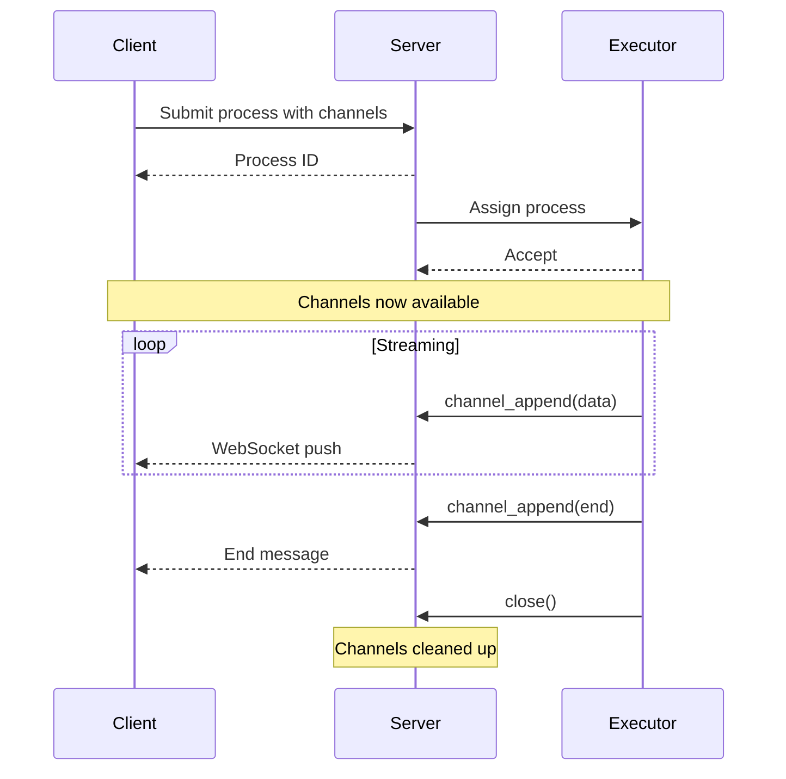
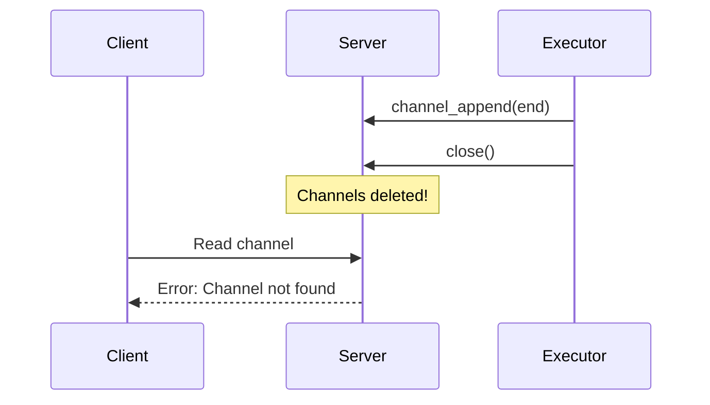
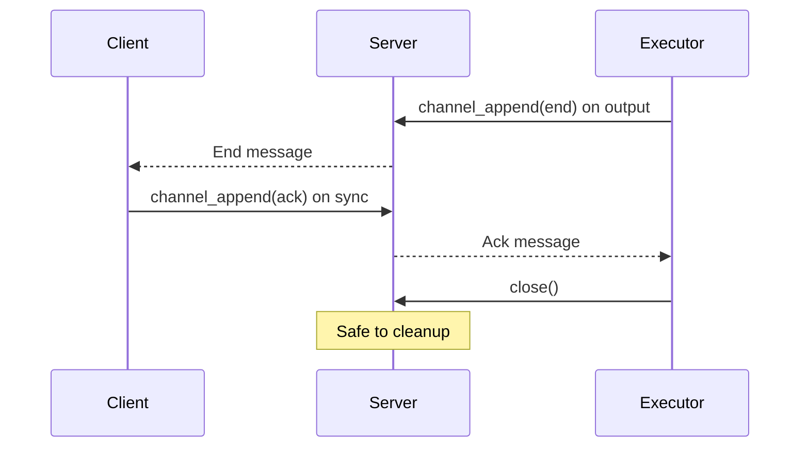

# Real-Time Communication with Channels

This tutorial explains how to use ColonyOS channels for real-time, bidirectional communication between executors and clients.

## What are Channels?

Channels are append-only message logs attached to processes that enable:

- **Streaming data**: Send results as they're produced, not just at the end
- **Bidirectional chat**: Executors and clients can exchange messages in real-time
- **Progress updates**: Report incremental progress during long-running tasks
- **Request-response**: Correlate responses to specific requests using `inreplyto`

## Architecture Overview



## Prerequisites

1. Rust toolchain (1.70 or later)
2. A running ColonyOS server (v1.9.6 or later for full channel support)
3. Basic familiarity with the [Getting Started](getting-started.md) guide

## Channel Basics

### Defining Channels in FunctionSpec

Channels must be declared in the `FunctionSpec` before the process runs:

```rust
use colonyos::core::FunctionSpec;

let mut spec = FunctionSpec::new("stream-data", "cli", "dev");
spec.channels = vec!["output".to_string(), "progress".to_string()];
```

Channels become available when the process enters the `RUNNING` state.

### Message Structure

Each channel message (entry) has:

- `sequence`: Client-assigned ordering number
- `payload`: The message content (sent as bytes, stored as base64)
- `msgtype`: Message type - `"data"`, `"end"`, or `"error"`
- `inreplyto`: Optional reference to another message's sequence
- `timestamp`: Server-assigned timestamp
- `senderid`: ID of the sender

## Example: Streaming Progress Updates

This example shows an executor that streams progress updates while processing.

### Executor Side

```rust
use colonyos::core::{Executor, FunctionSpec};

#[tokio::main]
async fn main() -> Result<(), Box<dyn std::error::Error>> {
    let colonyname = "dev";
    let executor_prvkey = "ddf7f7791208083b6a9ed975a72684f6406a269cfa36f1b1c32045c0a71fff05";

    // Register executor (see getting-started.md)
    // ...

    loop {
        match colonyos::assign(colonyname, 10, executor_prvkey).await {
            Ok(process) => {
                if process.spec.funcname == "long-task" {
                    // Stream progress updates
                    for i in 1..=10 {
                        // Simulate work
                        tokio::time::sleep(tokio::time::Duration::from_millis(500)).await;

                        // Send progress update (sequence = step number)
                        let progress = format!("Processing step {}/10", i);
                        colonyos::channel_append(
                            &process.processid,
                            "progress",
                            i as i64,
                            &progress,
                            "data",  // Message type
                            0,       // Not replying to anything
                            executor_prvkey,
                        ).await?;
                    }

                    // Send end-of-stream marker
                    colonyos::channel_append(
                        &process.processid,
                        "progress",
                        11,
                        "",
                        "end",  // Signals stream is complete
                        0,
                        executor_prvkey,
                    ).await?;

                    // Complete the process
                    colonyos::set_output(
                        &process.processid,
                        vec!["Task completed!".to_string()],
                        executor_prvkey,
                    ).await?;
                    colonyos::close(&process.processid, executor_prvkey).await?;
                }
            }
            Err(_) => {} // Timeout, continue
        }
    }
}
```

### Client Side - Reading Progress

```rust
use colonyos::core::FunctionSpec;

#[tokio::main]
async fn main() -> Result<(), Box<dyn std::error::Error>> {
    let prvkey = "ddf7f7791208083b6a9ed975a72684f6406a269cfa36f1b1c32045c0a71fff05";

    // Submit a process with a progress channel
    let mut spec = FunctionSpec::new("long-task", "cli", "dev");
    spec.channels = vec!["progress".to_string()];

    let process = colonyos::submit(&spec, prvkey).await?;
    println!("Submitted: {}", process.processid);

    // Wait for process to start running (channels become available)
    let running_process = colonyos::subscribe_process(
        &process,
        colonyos::core::RUNNING,
        30,  // timeout seconds
        prvkey,
    ).await?;

    println!("Process is running, subscribing to progress...");

    // Subscribe to channel updates
    colonyos::subscribe_channel(
        &running_process.processid,
        "progress",
        0,   // Start from sequence 0
        60,  // Timeout seconds
        prvkey,
        |entries| {
            for entry in &entries {
                if entry.msgtype == "end" {
                    println!("Stream complete!");
                    return false;  // Stop subscribing
                }
                println!("Progress: {}", entry.payload_as_string());
            }
            true  // Continue subscribing
        },
    ).await?;

    // Get final result
    let final_process = colonyos::get_process(&process.processid, prvkey).await?;
    println!("Output: {:?}", final_process.output);

    Ok(())
}
```

## Example: Bidirectional Chat

This example demonstrates a chat-like interaction where a client and executor exchange messages.

### Executor Side - Chat Bot

```rust
use std::sync::Arc;
use std::sync::atomic::{AtomicBool, Ordering};

#[tokio::main]
async fn main() -> Result<(), Box<dyn std::error::Error>> {
    let colonyname = "dev";
    let executor_prvkey = "ddf7f7791208083b6a9ed975a72684f6406a269cfa36f1b1c32045c0a71fff05";

    loop {
        match colonyos::assign(colonyname, 10, executor_prvkey).await {
            Ok(process) => {
                if process.spec.funcname == "chat" {
                    println!("Starting chat session: {}", process.processid);

                    let processid = process.processid.clone();
                    let prvkey = executor_prvkey.to_string();
                    let mut response_seq: i64 = 2;  // Even numbers for executor

                    // Subscribe to chat channel for incoming messages
                    let result = colonyos::subscribe_channel(
                        &processid,
                        "chat",
                        0,
                        300,  // 5 minute timeout
                        &prvkey,
                        |entries| {
                            for entry in &entries {
                                // Only respond to client messages (odd sequence numbers)
                                if entry.sequence % 2 == 1 {
                                    let msg = entry.payload_as_string();
                                    println!("Client: {}", msg);

                                    // Generate response
                                    let response = match msg.to_lowercase().as_str() {
                                        "hello" | "hi" => "Hello! How can I help you?",
                                        "bye" | "goodbye" => "Goodbye! Have a great day!",
                                        _ => "I received your message!",
                                    };

                                    // Send response with inreplyto
                                    let rt = tokio::runtime::Handle::current();
                                    let pid = processid.clone();
                                    let key = prvkey.clone();
                                    let resp = response.to_string();
                                    let seq = response_seq;
                                    let reply_to = entry.sequence;

                                    rt.spawn(async move {
                                        let _ = colonyos::channel_append(
                                            &pid, "chat", seq, &resp, "data", reply_to, &key,
                                        ).await;
                                    });

                                    response_seq += 2;

                                    // End chat on goodbye
                                    if msg.to_lowercase().contains("bye") {
                                        // Send end message
                                        let pid = processid.clone();
                                        let key = prvkey.clone();
                                        let seq = response_seq;
                                        rt.spawn(async move {
                                            let _ = colonyos::channel_append(
                                                &pid, "chat", seq, "", "end", 0, &key,
                                            ).await;
                                        });
                                        return false;  // Stop subscribing
                                    }
                                }
                            }
                            true  // Continue
                        },
                    ).await;

                    // Close the process
                    colonyos::close(&processid, executor_prvkey).await?;
                    println!("Chat session ended");
                }
            }
            Err(_) => {}
        }
    }
}
```

### Client Side - Chat Client

```rust
use colonyos::core::FunctionSpec;

#[tokio::main]
async fn main() -> Result<(), Box<dyn std::error::Error>> {
    let prvkey = "ddf7f7791208083b6a9ed975a72684f6406a269cfa36f1b1c32045c0a71fff05";

    // Submit chat process
    let mut spec = FunctionSpec::new("chat", "cli", "dev");
    spec.channels = vec!["chat".to_string()];

    let process = colonyos::submit(&spec, prvkey).await?;

    // Wait for process to start
    let running = colonyos::subscribe_process(
        &process,
        colonyos::core::RUNNING,
        30,
        prvkey,
    ).await?;

    let processid = running.processid.clone();

    // Start background subscription to receive responses
    let pid_for_sub = processid.clone();
    let key_for_sub = prvkey.to_string();
    let sub_handle = tokio::spawn(async move {
        colonyos::subscribe_channel(
            &pid_for_sub,
            "chat",
            0,
            300,
            &key_for_sub,
            |entries| {
                for entry in &entries {
                    if entry.msgtype == "end" {
                        println!("[Chat ended]");
                        return false;
                    }
                    // Print executor responses (even sequence numbers)
                    if entry.sequence % 2 == 0 && entry.msgtype != "end" {
                        println!("Bot: {}", entry.payload_as_string());
                    }
                }
                true
            },
        ).await
    });

    // Send messages
    let messages = vec!["Hello", "How are you?", "Goodbye"];
    for (i, msg) in messages.iter().enumerate() {
        let seq = (i as i64 * 2) + 1;  // Odd numbers for client
        println!("You: {}", msg);
        colonyos::channel_append(
            &processid,
            "chat",
            seq,
            msg,
            "data",
            0,
            prvkey,
        ).await?;

        // Small delay between messages
        tokio::time::sleep(tokio::time::Duration::from_millis(500)).await;
    }

    // Wait for subscription to complete
    sub_handle.await??;

    Ok(())
}
```

## Reading Channel History

You can read all messages from a channel at any time:

```rust
// Read up to 100 messages starting from sequence 0
let entries = colonyos::channel_read(
    &processid,
    "chat",
    0,      // Start sequence
    100,    // Max entries
    prvkey,
).await?;

for entry in entries {
    println!(
        "[{}] seq={} reply_to={}: {}",
        entry.msgtype,
        entry.sequence,
        entry.inreplyto,
        entry.payload_as_string()
    );
}
```

## Message Types

Use message types to signal stream state:

| Type | Purpose |
|------|---------|
| `"data"` or `""` | Regular data message |
| `"end"` | End-of-stream marker - signals no more messages will be sent |
| `"error"` | Error message - signals an error occurred |

```rust
// Send end-of-stream
colonyos::channel_append(&processid, "output", seq, "", "end", 0, prvkey).await?;

// Send error
colonyos::channel_append(&processid, "output", seq, "Something went wrong", "error", 0, prvkey).await?;
```

## Best Practices

### 1. Use Sequence Numbers for Ordering

Assign meaningful sequence numbers:

```rust
// Client uses odd numbers, executor uses even
let client_seq = 1, 3, 5, ...;
let executor_seq = 2, 4, 6, ...;
```

### 2. Use inreplyto for Request-Response

Link responses to their requests:

```rust
// Client sends request with seq=5
colonyos::channel_append(&pid, "chat", 5, "What time is it?", "data", 0, prvkey).await?;

// Executor responds with inreplyto=5
colonyos::channel_append(&pid, "chat", 6, "It's 3:00 PM", "data", 5, prvkey).await?;
```

### 3. Always Send End Message

Signal completion so subscribers know when to stop:

```rust
colonyos::channel_append(&pid, "output", final_seq, "", "end", 0, prvkey).await?;
```

### 4. Subscribe Before Sending

Start the subscription before sending messages to avoid missing responses:

```rust
// Start subscription in background first
let handle = tokio::spawn(async move {
    colonyos::subscribe_channel(...).await
});

// Then send messages
colonyos::channel_append(...).await?;

// Wait for subscription
handle.await?;
```

## Sync Channels for Reliable Completion

When a process closes, its channels are immediately cleaned up. This can cause race conditions where clients miss the final messages. Use a **sync channel** to ensure reliable completion.

### The Problem



### The Solution: Acknowledgment Pattern

Use a dedicated sync channel for the client to acknowledge receipt before the executor closes:



### Implementation

**Executor side** - wait for client ACK before closing:

```rust
// Send end message on output channel
colonyos::channel_append(&pid, "output", seq, "", "end", 0, prvkey).await?;

// Wait for client acknowledgment on sync channel
loop {
    let msgs = colonyos::channel_read(&pid, "sync", 0, 10, prvkey).await?;
    if msgs.iter().any(|m| m.payload_as_string() == "ack") {
        break;
    }
    tokio::time::sleep(tokio::time::Duration::from_millis(100)).await;
}

// Now safe to close - client has received all messages
colonyos::close(&pid, prvkey).await?;
```

**Client side** - send ACK after receiving end message:

```rust
// Define channels in spec
let mut spec = FunctionSpec::new("stream-task", "cli", "dev");
spec.channels = vec!["output".to_string(), "sync".to_string()];

let process = colonyos::submit(&spec, prvkey).await?;

// Wait for process to start
let running = colonyos::subscribe_process(
    &process,
    colonyos::core::RUNNING,
    30,
    prvkey,
).await?;

// Subscribe to output channel
colonyos::subscribe_channel(
    &running.processid,
    "output",
    0,
    60,
    prvkey,
    |entries| {
        for entry in &entries {
            if entry.msgtype == "end" {
                // Send acknowledgment
                let pid = running.processid.clone();
                let key = prvkey.to_string();
                tokio::spawn(async move {
                    let _ = colonyos::channel_append(
                        &pid, "sync", 1, "ack", "data", 0, &key,
                    ).await;
                });
                return false;  // Stop subscribing
            }
            println!("Received: {}", entry.payload_as_string());
        }
        true
    },
).await?;
```

### When to Use Sync Channels

Use sync channels when:

- **Critical data**: You cannot afford to lose any messages
- **Confirmation required**: The executor needs to know the client received everything
- **Ordered shutdown**: Resources must be cleaned up in a specific order

For simple streaming where occasional message loss is acceptable, the basic end message pattern is sufficient.

## Troubleshooting

### "Channel not found" Error

- Ensure the channel is declared in `spec.channels` before submitting
- Wait for the process to be in `RUNNING` state before accessing channels
- Channels are removed when the process is closed

### Messages Not Received

- Check that you're subscribing before messages are sent
- Verify the channel name matches exactly
- Ensure the process is still running

### Subscription Times Out

- The subscription callback should return `false` to stop, or the timeout will occur
- Check for the `"end"` message type to know when streaming is complete

## Next Steps

- See the [API Reference](API.md) for all channel functions
- Check out [Blueprints](blueprints.md) for declarative state management
- Explore the [examples](../examples/) directory
