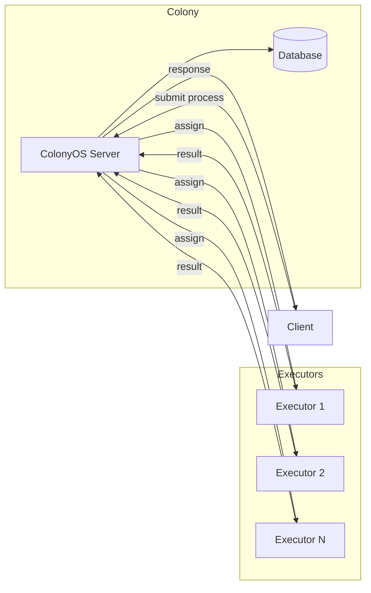
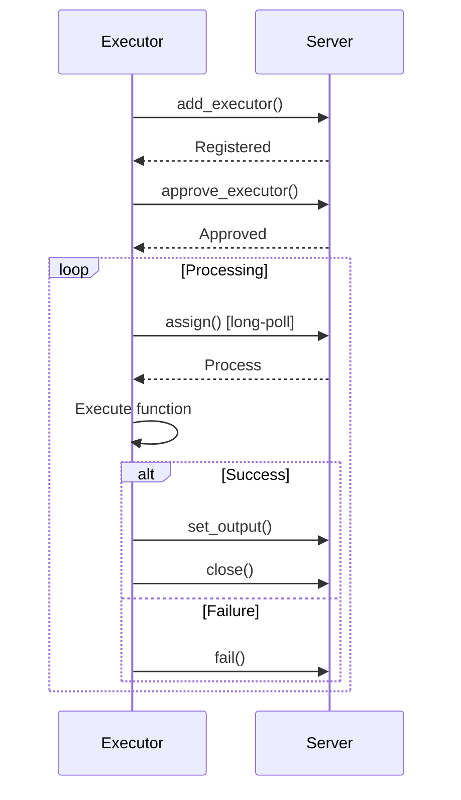
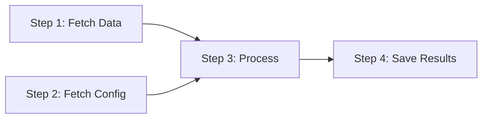

# Getting Started with ColonyOS Rust SDK

This tutorial will guide you through building your first ColonyOS executor in Rust.

## What is ColonyOS?

ColonyOS is a distributed meta-orchestrator that enables building compute continuums across different platforms. The key concepts are:

- **Colony**: A distributed runtime environment
- **Executor**: A worker that pulls and executes processes
- **Process**: A unit of work defined by a FunctionSpec
- **Workflow**: A DAG of processes with dependencies

## Architecture



## Executor Lifecycle



## Prerequisites

1. Rust toolchain (1.70 or later)
2. A running ColonyOS server

### Starting a ColonyOS Server

```bash
# Clone the colonies repository
git clone https://github.com/colonyos/colonies
cd colonies

# Start with Docker Compose
source docker-compose.env
docker-compose up -d
```

The server will be available at `http://localhost:50080`.

## Step 1: Create a New Rust Project

```bash
cargo new my-executor
cd my-executor
```

Add dependencies to `Cargo.toml`:

```toml
[dependencies]
colonies = "0.1"
tokio = { version = "1", features = ["full"] }
```

## Step 2: Understanding Keys and Identity

ColonyOS uses cryptographic keys for identity and authentication:

```rust
use colonyos::crypto;

fn main() {
    // Generate a new private key
    let prvkey = crypto::gen_prvkey();
    println!("Private key: {}", prvkey);

    // Derive the public ID (this is your executor's identity)
    let id = crypto::gen_id(&prvkey);
    println!("Executor ID: {}", id);
}
```

For development, you can use the test keys from the docker-compose environment:

```rust
// Test executor key
let executor_prvkey = "ddf7f7791208083b6a9ed975a72684f6406a269cfa36f1b1c32045c0a71fff05";

// Colony owner key (for approving executors)
let colony_prvkey = "ba949fa134981372d6da62b6a56f336ab4d843b22c02a4257dcf7d0d73097514";
```

## Step 3: Build a Simple Executor

Replace `src/main.rs` with:

```rust
use colonyos::core::{Executor, Log};

#[tokio::main]
async fn main() -> Result<(), Box<dyn std::error::Error>> {
    // Configuration
    let colonyname = "dev";
    let executor_prvkey = "ddf7f7791208083b6a9ed975a72684f6406a269cfa36f1b1c32045c0a71fff05";
    let colony_prvkey = "ba949fa134981372d6da62b6a56f336ab4d843b22c02a4257dcf7d0d73097514";

    // Step 1: Generate executor ID from private key
    let executor_id = colonyos::crypto::gen_id(executor_prvkey);
    println!("Executor ID: {}", executor_id);

    // Step 2: Create the executor
    let executor = Executor::new(
        "my-rust-executor",  // Name
        &executor_id,         // ID (derived from private key)
        "cli",                // Type (must match targettype in process specs)
        colonyname,           // Colony name
    );

    // Step 3: Register with the server
    match colonyos::add_executor(&executor, executor_prvkey).await {
        Ok(e) => println!("Registered executor: {}", e.executorname),
        Err(e) => println!("Registration note: {}", e),
    }

    // Step 4: Approve the executor (requires colony owner key)
    match colonyos::approve_executor(colonyname, "my-rust-executor", colony_prvkey).await {
        Ok(_) => println!("Executor approved!"),
        Err(e) => println!("Approval note: {}", e),
    }

    println!("\nExecutor is ready! Waiting for processes...");
    println!("Test it with: colonies function exec --func hello --targettype cli\n");

    // Step 5: Main processing loop
    loop {
        // Wait for a process (10 second timeout)
        match colonyos::assign(colonyname, 10, executor_prvkey).await {
            Ok(process) => {
                println!("Got process: {} ({})", process.processid, process.spec.funcname);

                // Handle the function
                match process.spec.funcname.as_str() {
                    "hello" => {
                        println!("  -> Saying hello!");
                        colonyos::set_output(
                            &process.processid,
                            vec!["Hello from Rust!".to_string()],
                            executor_prvkey,
                        ).await?;
                        colonyos::close(&process.processid, executor_prvkey).await?;
                        println!("  -> Done!");
                    }
                    "echo" => {
                        let msg = process.spec.args.get(0)
                            .cloned()
                            .unwrap_or_else(|| "no message".to_string());
                        println!("  -> Echoing: {}", msg);
                        colonyos::set_output(
                            &process.processid,
                            vec![msg],
                            executor_prvkey,
                        ).await?;
                        colonyos::close(&process.processid, executor_prvkey).await?;
                        println!("  -> Done!");
                    }
                    _ => {
                        println!("  -> Unknown function, failing");
                        colonyos::fail(&process.processid, executor_prvkey).await?;
                    }
                }
            }
            Err(e) => {
                // Connection error vs timeout
                if e.conn_err() {
                    eprintln!("Connection error: {}", e);
                    tokio::time::sleep(tokio::time::Duration::from_secs(5)).await;
                }
                // Timeout is normal - just continue
            }
        }
    }
}
```

## Step 4: Run the Executor

```bash
cargo run
```

You should see:

```
Executor ID: 3fc05cf3df4b494e95d6a3d297a34f19938f7daa7422ab0d4f794454133341ac
Registered executor: my-rust-executor
Executor approved!

Executor is ready! Waiting for processes...
Test it with: colonies function exec --func hello --targettype cli
```

## Step 5: Submit a Process

In another terminal, use the Colonies CLI to submit a process:

```bash
# Say hello
colonies function exec --func hello --targettype cli --wait

# Echo a message
colonies function exec --func echo --args "Hello World" --targettype cli --wait
```

You should see the executor process it:

```
Got process: abc123... (hello)
  -> Saying hello!
  -> Done!
```

## Step 6: Submit from Rust

You can also submit processes from Rust:

```rust
use colonyos::core::FunctionSpec;

#[tokio::main]
async fn main() -> Result<(), Box<dyn std::error::Error>> {
    let prvkey = "ddf7f7791208083b6a9ed975a72684f6406a269cfa36f1b1c32045c0a71fff05";

    // Create a function spec
    let mut spec = FunctionSpec::new("echo", "cli", "dev");
    spec.args = vec!["Hello from Rust client!".to_string()];

    // Submit
    let process = colonyos::submit(&spec, prvkey).await?;
    println!("Submitted: {}", process.processid);

    // Wait for completion
    loop {
        let p = colonyos::get_process(&process.processid, prvkey).await?;
        if p.state == colonyos::core::SUCCESS {
            println!("Output: {:?}", p.output);
            break;
        } else if p.state == colonyos::core::FAILED {
            println!("Failed!");
            break;
        }
        tokio::time::sleep(tokio::time::Duration::from_millis(100)).await;
    }

    Ok(())
}
```

## Step 7: Add Logging

Executors can add logs that are visible via the CLI:

```rust
use colonyos::core::Log;

// Inside your process handler:
let log = Log {
    processid: process.processid.clone(),
    colonyname: "dev".to_string(),
    executorname: "my-rust-executor".to_string(),
    message: "Starting to process...".to_string(),
    timestamp: 0,  // Server will set this
};
colonyos::add_log(&log, executor_prvkey).await?;
```

View logs with:

```bash
colonies log get -e my-rust-executor
```

## Step 8: Workflows

Workflows are DAGs (Directed Acyclic Graphs) of processes with dependencies:



Create a workflow with dependencies:

```rust
use colonyos::core::{FunctionSpec, WorkflowSpec};

let mut step1 = FunctionSpec::new("echo", "cli", "dev");
step1.nodename = "step1".to_string();
step1.args = vec!["Step 1".to_string()];

let mut step2 = FunctionSpec::new("echo", "cli", "dev");
step2.nodename = "step2".to_string();
step2.args = vec!["Step 2".to_string()];
step2.conditions.dependencies = vec!["step1".to_string()];  // Runs after step1

let workflow = WorkflowSpec {
    colonyname: "dev".to_string(),
    functionspecs: vec![step1, step2],
};

let pg = colonyos::submit_workflow(&workflow, prvkey).await?;
println!("Workflow: {}", pg.processgraphid);
```

## Next Steps

- See the [API Reference](../API.md) for all available functions
- Check out the [examples](../examples/) directory
- Read about [Blueprints](https://github.com/colonyos/colonies) for infrastructure reconciliation

## Troubleshooting

### "Connection refused" error

Make sure the ColonyOS server is running:

```bash
docker-compose ps
```

### "Executor already exists" error

This is normal if you've run the executor before. The executor is already registered.

### Process times out

Make sure:
1. The `executortype` matches the `targettype` in the process spec
2. The executor is approved (check with `colonies executor ls`)

### Getting the test keys

```bash
# From the colonies repository:
cat docker-compose.env | grep PRVKEY
```
