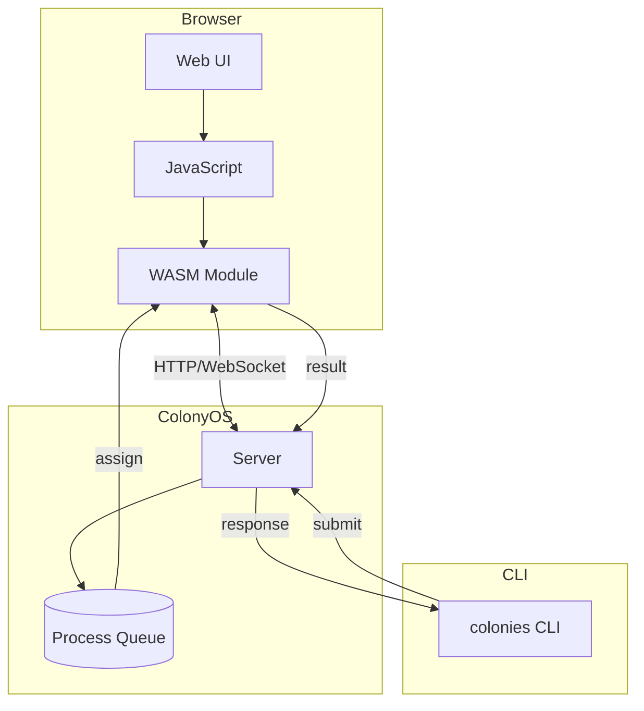
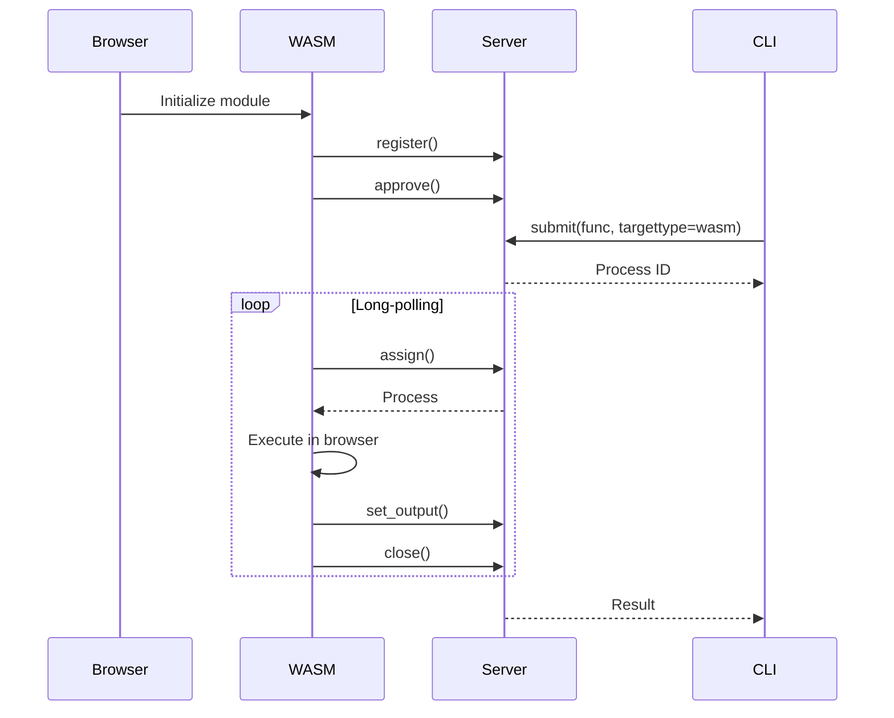
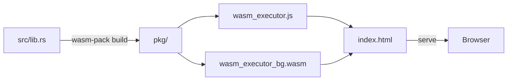

# Building a WASM Executor

This tutorial explains how to build a ColonyOS executor that runs in WebAssembly (WASM), enabling executors to run directly in web browsers.


## Overview

A WASM executor allows you to run ColonyOS workers in the browser. This is useful for:

- Distributing computation to end-user devices
- Building browser-based development tools
- Creating interactive demos
- Edge computing scenarios where executors run on client devices

## Architecture



## WASM Executor Flow



## Prerequisites

- Rust toolchain with `wasm32-unknown-unknown` target
- `wasm-pack` for building and packaging WASM modules
- A ColonyOS server accessible from the browser

### Installing Prerequisites

```bash
# Add WASM target
rustup target add wasm32-unknown-unknown

# Install wasm-pack
cargo install wasm-pack
```

## Project Structure

The WASM executor example is located in `examples/wasm/`:

```
examples/wasm/
├── Cargo.toml      # Dependencies for WASM build
├── src/
│   └── lib.rs      # Executor implementation
└── index.html      # Browser UI for running the executor
```

## Understanding the Code

### Dependencies (Cargo.toml)

```toml
[package]
name = "wasm-executor"
version = "0.1.0"
edition = "2021"

[lib]
crate-type = ["cdylib", "rlib"]

[dependencies]
# ColonyOS SDK with WASM feature
colonyos = { version = "1.0", default-features = false, features = ["wasm"] }

# WASM bindings
wasm-bindgen = "0.2.88"
wasm-bindgen-futures = "0.4.38"
js-sys = "0.3"
web-sys = { version = "0.3", features = ["console", "Window", ...] }

# Async runtime for WASM
gloo-timers = { version = "0.3", features = ["futures"] }
```

Key points:
- `crate-type = ["cdylib"]` enables WASM compilation
- `colonyos` uses `default-features = false` and `features = ["wasm"]`
- `wasm-bindgen` provides JavaScript interop
- `gloo-timers` provides async timer support in WASM

### Executor Implementation (src/lib.rs)

The executor auto-generates its private key and uses the colony private key for registration:

```rust
use colonyos::core::{Executor, Process};
use colonyos::crypto;
use wasm_bindgen::prelude::*;

#[wasm_bindgen]
pub struct WasmExecutorConfig {
    server_url: String,
    colony_name: String,
    executor_name: String,
    executor_type: String,
    colony_prvkey: String,  // Colony owner key for registration
}

#[wasm_bindgen]
pub struct WasmExecutor {
    config: WasmExecutorConfig,
    private_key: String,    // Auto-generated executor key
    executor_id: String,
    running: bool,
}

#[wasm_bindgen]
impl WasmExecutor {
    #[wasm_bindgen(constructor)]
    pub fn new(config: WasmExecutorConfig) -> Self {
        // Auto-generate a new private key for this executor
        let private_key = crypto::gen_prvkey();
        let executor_id = crypto::gen_id(&private_key);

        WasmExecutor {
            config,
            private_key,
            executor_id,
            running: false,
        }
    }

    #[wasm_bindgen]
    pub async fn register(&self) -> Result<(), JsValue> {
        let executor = Executor::new(
            &self.config.executor_name,
            &self.executor_id,
            &self.config.executor_type,
            &self.config.colony_name,
        );

        // Register using colony owner key
        colonyos::add_executor(&executor, &self.config.colony_prvkey)
            .await
            .map_err(|e| JsValue::from_str(&e.to_string()))?;

        // Auto-approve using colony owner key
        colonyos::approve_executor(
            &self.config.colony_name,
            &self.config.executor_name,
            &self.config.colony_prvkey,
        ).await.map_err(|e| JsValue::from_str(&e.to_string()))?;

        Ok(())
    }

    #[wasm_bindgen]
    pub async fn start(&mut self) -> Result<(), JsValue> {
        self.running = true;

        while self.running {
            // Long-poll for processes (10 second timeout)
            match colonyos::assign(&self.config.colony_name, 10, &self.private_key).await {
                Ok(process) => {
                    self.execute_process(&process).await?;
                }
                Err(e) => {
                    if e.conn_err() {
                        // Wait before retrying on connection error
                        gloo_timers::future::TimeoutFuture::new(1000).await;
                    }
                    // Timeout means no process available - continue polling
                }
            }
        }

        Ok(())
    }
}
```

### Handling Functions

The executor can handle different function types:

```rust
async fn execute_process(&self, process: &Process) -> Result<(), String> {
    match process.spec.funcname.as_str() {
        "echo" => {
            let output = process.spec.args.first().cloned().unwrap_or_default();
            self.complete_process(&process.processid, vec![output]).await
        }
        "add" => {
            let a: f64 = process.spec.args[0].parse().unwrap();
            let b: f64 = process.spec.args[1].parse().unwrap();
            self.complete_process(&process.processid, vec![(a + b).to_string()]).await
        }
        "browser_info" => {
            // Access browser APIs via web-sys
            let window = web_sys::window().unwrap();
            let navigator = window.navigator();
            let user_agent = navigator.user_agent().unwrap_or_default();
            self.complete_process(&process.processid, vec![user_agent]).await
        }
        _ => {
            colonyos::fail(&process.processid, &self.private_key).await;
            Ok(())
        }
    }
}
```

### JavaScript Integration (index.html)

```javascript
import init, { WasmExecutor, WasmExecutorConfig } from './pkg/wasm_executor.js';

async function main() {
    // Initialize WASM module
    await init();

    // Create configuration (executor key is auto-generated)
    const config = new WasmExecutorConfig(
        "http://localhost:50080",  // Server URL
        "dev",                      // Colony name
        "wasm-executor",            // Executor name
        "wasm",                     // Executor type
        "colony_private_key_here"   // Colony owner key for registration
    );

    // Create and start executor
    const executor = new WasmExecutor(config);
    await executor.register();  // Registers and auto-approves
    await executor.start();     // Starts long-polling for processes
}

main().catch(console.error);
```

## Building



```bash
cd examples/wasm

# Build for web target
wasm-pack build --target web

# The output is in pkg/
ls pkg/
# wasm_executor.js
# wasm_executor_bg.wasm
# ...
```

## Running

1. Start a ColonyOS server (e.g., using docker-compose):

```bash
cd /path/to/colonies
docker-compose up -d
source docker-compose.env
```

2. Serve the example with a local web server:

```bash
cd examples/wasm

# Using Python
python3 -m http.server 8080

# Or using Node.js
npx serve .
```

3. Open `http://localhost:8080` in your browser (or use your machine's IP for remote access)

4. Configure the settings:
   - **Server URL**: Your ColonyOS server address (e.g., `http://10.0.0.200:50080`)
   - **Colony Name**: The colony to join (e.g., `dev`)
   - **Executor Name**: A unique name for this executor
   - **Executor Type**: The type for process matching (e.g., `wasm`)
   - **Colony Private Key**: The colony owner's private key for registration

5. Click "Start Executor"

## Submitting Processes

From the CLI, submit processes targeting the WASM executor:

```bash
# Source environment variables
source docker-compose.env

# Echo function
colonies function exec --func echo --args "Hello from browser!" --targettype wasm --wait --out

# Add two numbers
colonies function exec --func add --args 5 --args 3 --targettype wasm --wait --out

# Multiply two numbers
colonies function exec --func multiply --args 7 --args 6 --targettype wasm --wait --out

# Get a greeting
colonies function exec --func greet --args "World" --targettype wasm --wait --out

# Get browser information
colonies function exec --func browser_info --targettype wasm --wait --out
```

## Supported Functions

The example WASM executor supports these functions:

| Function | Arguments | Description |
|----------|-----------|-------------|
| `echo` | `message` | Returns the message back |
| `add` | `a, b` | Adds two numbers |
| `multiply` | `a, b` | Multiplies two numbers |
| `greet` | `name` | Returns a greeting message |
| `browser_info` | none | Returns browser user agent and language |

## Security Considerations

- **Colony Private Key**: The colony owner key is used for self-registration. In production, consider using a registration service instead.
- **Executor Keys**: Each executor auto-generates its own private key on startup.
- **Process Validation**: Validate process inputs before processing to prevent injection attacks.

## Extending the Executor

To add new functions:

1. Add a new match arm in `execute_process`:

```rust
"my_function" => {
    // Your implementation
    let result = do_something(&process.spec.args);
    self.complete_process(&process.processid, vec![result]).await
}
```

2. Use browser APIs via `web-sys` for capabilities like:
   - Canvas drawing
   - WebGL computations
   - Geolocation
   - WebRTC communication

## Troubleshooting

### Connection Errors

If you see "Connection error" in the browser console:
- Verify the server URL is correct and accessible
- Check that the server is running
- For remote servers, ensure the port is open

### "No process available"

This is normal - it means the long-poll timed out without a process. The executor will automatically retry.

### Registration Errors

If registration fails with "Access denied":
- Verify the colony private key is correct
- Check that the colony exists on the server

### Memory Issues

WebAssembly has memory limits. For large computations:
- Process data in chunks
- Use streaming where possible
- Monitor memory usage in browser dev tools

## Next Steps

- See [getting-started.md](getting-started.md) for general SDK usage
- See [API.md](API.md) for the complete API reference
- Explore the source code in [examples/wasm/src/lib.rs](../examples/wasm/src/lib.rs)
